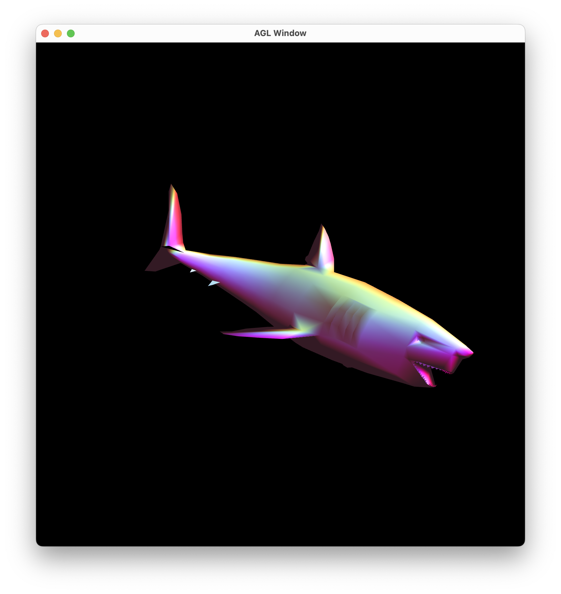

# mesh-viewer

Implements a simple PLY viewer



## How to build

*Windows*

Open git bash to the directory containing this repository.

```
mesh-viewer $ mkdir build
mesh-viewer $ cd build
mesh-viewer/build $ cmake ..
mesh-viewer/build $ start mesh-viewer.sln
```

Your solution file should contain two projects: `mesh-viewer` and `test-ply-mesh`.
To run from the git bash command shell, 

```
mesh-viewer/build $ ../bin/Debug/test-ply-mesh.exe
mesh-viewer/build $ ../bin/Debug/mesh-viewer.exe
```

*macOS*

Open terminal to the directory containing this repository.

```
mesh-viewer $ mkdir build
mesh-viewer $ cd build
mesh-viewer/build $ cmake ..
mesh-viewer/build $ make
```

To run each program from build, you would type

```
mesh-viewer/build $ ../bin/mesh-viewer
```

## Demo of basic features

- Models can be swapped using the N key to go to the next model or the P key to go to the previous model.

<video src="readme_assets/model_swap.mov"></video>

- Shaders can be swapped using the S key. The shaders are as follows:
    - Pearl (Phong pixel shader with pearlescent reflections with dynamic light position)
    - Breathe (Phong pixel shader with vertices that animate away from normals)
    - Unlit
    - Normals
    - Phong Vertex
    - Phong Pixel

<video src="readme_assets/shader_swap.mov"></video>

## Unique features 

### Pearl Shader
The pearl shader uses the Phong pixel shader as a base and adds a component to the diffuse lighting which adds color based on the `r` vector to simulate pearlescent materials.

<video src="readme_assets/pearl.mov"></video>

### Breathe
The breathe shader uses the Phong pixel shader as a base and animates the `gl_position` vector in the vertex shader to move each vertex in the direction of its normal. This makes the mesh appear to "breathe".

<video src="readme_assets/breathe.mov"></video>
